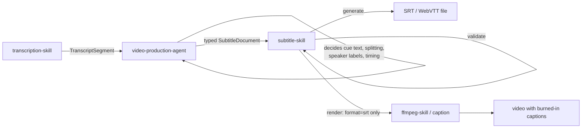

# subtitle-skill

**Deterministic subtitle production and rendering for AI agents.**

[](https://github.com/kajisho5/subtitle-skill/actions/workflows/ci.yml)


subtitle-skill is not "AI that writes subtitles." It is the execution
layer that takes a subtitle document another agent has already decided
on and turns it into a real artifact — validated, deterministic,
verified, and traceable:

```
typed SubtitleDocument → validate → generate (SRT/WebVTT) or render (burn-in) → verify output → provenance
```

It exists so that **an upstream agent decides**, and **subtitle-skill
executes safely** — no transcription, no editorial judgement, no
arbitrary FFmpeg. See [What it does / doesn't do](#what-it-does--doesnt-do)
below.

---

## Quick Start

```bash
pip install -e .            # from a checkout; not yet published to PyPI
subtitle-skill doctor --json    # what can actually run on this machine
subtitle-skill contract --json  # machine-readable operations/formats/errors
```

Generate an SRT file from a typed subtitle document (no video needed):

```bash
cat > request.json <<'EOF'
{
  "operation": "generate",
  "workspace": "/tmp/subtitles-demo",
  "format": "srt",
  "output_path": "captions.srt",
  "subtitle": {
    "id": "doc-1",
    "language": "en",
    "cues": [
      {"id": "c1", "start": 0.0, "end": 2.5, "text": "Hello and welcome"},
      {"id": "c2", "start": 2.5, "end": 5.0, "text": "to the show.", "speaker": "Host"}
    ]
  }
}
EOF
subtitle-skill run request.json --json
```

```json
{
  "status": "ok", "operation": "generate", "output": ".../captions.srt",
  "sha256": "4ffe0640...", "size": 103, "reused": false,
  "observation": [], "timeline": {"cue_count": 2}, ...
}
```

Burning that subtitle into a video (`"operation": "render"`) works the
same way, but requires `format: "srt"` and an [ffmpeg-skill](#ffmpeg-skill-integration)
install — see [Operations](#operations).

---

## What it does / doesn't do

subtitle-skill owns exactly this slice of a captioning pipeline:

| | |
|---|---|
| ✅ Validate a subtitle timeline (overlaps, bad timestamps, unreadable cues) | ❌ Decide what the subtitle text should say |
| ✅ Generate SRT / WebVTT files | ❌ Transcribe audio (speech-to-text) |
| ✅ Burn subtitles into a video (delegated) | ❌ Speaker diarization |
| ✅ Deterministic, content-addressed caching | ❌ Translate or summarize |
| ✅ Verify the actual output, not just exit code 0 | ❌ Decide how to split a sentence into cues |
| ✅ Record provenance for every artifact | ❌ Judge whether a render "looks right" |
| | ❌ Run arbitrary FFmpeg commands or filters |

That right-hand column isn't a list of missing features — it's the
point. Those decisions belong to whatever agent is driving the
pipeline (typically `video-production-agent`); subtitle-skill's job is
to take the *result* of that decision — a typed `SubtitleDocument` — and
execute it safely, the same way every time.

---

## Architecture



subtitle-skill is a *leaf* execution skill: it receives an already-decided,
typed request and executes it mechanically. It never reasons about
content — only about correctness and safety.

### Responsibility boundary

| Concern | Owner |
|---|---|
| Speech recognition / transcription | `transcription-skill` |
| Speaker diarization | `transcription-skill` (or a future dedicated skill) |
| Deciding *what* the text should say, how to split/merge cues, which speaker to show | `video-production-agent` |
| Subtitle cue/timeline validation, SRT/WebVTT generation, burn-in orchestration | **`subtitle-skill`** |
| Building the actual FFmpeg command/filtergraph and encoding | `ffmpeg-skill` |

subtitle-skill treats a `transcription-skill` segment and a subtitle
`SubtitleCue` as **different types**. The `TranscriptSegment → SubtitleCue`
decision (splitting long sentences, whether to show a speaker label,
etc.) is the caller's responsibility; subtitle-skill only ever receives
already-typed `SubtitleCue` objects.

### Ecosystem

```
video-production-agent
        │
        ├── media-analysis-skill      (not integrated with; source not reviewed)
        ├── transcription-skill       (upstream of this skill's input)
        ├── subtitle-skill            <-- this repo
        ├── audio-production-skill    (not integrated with; source not reviewed)
        ├── motion-graphics-skill     (not integrated with; source not reviewed)
        ├── color-grading-skill       (not integrated with; source not reviewed)
        ├── thumbnail-skill           (not integrated with; source not reviewed)
        └── ffmpeg-skill              (downstream of `render`; verified integration)
```

Only the `ffmpeg-skill` edge is an actual, verified integration (see
[ffmpeg-skill integration](#ffmpeg-skill-integration)). Every other
skill above is named for orientation only — this repository does not
call them, and their contracts were not reviewed here. Do not read
"listed" as "integrated."

---

## Data model

Every subtitle is a typed `SubtitleDocument`, never a bare dict:

- **`SubtitleDocument`**: `id`, `version`, `language` (BCP-47-ish tag),
  `cues` (ordered list of `SubtitleCue`), `metadata`.
- **`SubtitleCue`**: `id`, `start` (sec), `end` (sec), `text`,
  `speaker` (optional), `style` (optional, allowlisted), `metadata`
  (optional — auxiliary/provenance data, never rendered into subtitle
  text).
- **`SubtitleStyle`**: allowlisted fields only — `align`, `position`,
  `line`, `size`, `bold`, `italic`, `color`. There is no free-form style
  string; unknown fields are rejected.

---

## Operations

Only two operations exist. Both appear in `contract --json`; nothing
else does.

### `generate`

No video I/O. Validates the subtitle document and writes an SRT or
WebVTT file.

### `render`

Requires `video_input`. **`format` must be `"srt"`** — ffmpeg-skill's
`caption` tool (which does the actual burn-in) has no WebVTT support, so
`render` with `format: "vtt"` fails immediately with
`UNSUPPORTED_FORMAT`, before anything is generated. Validates the
document (against the video's *actual*, measured duration — see
[Validation](#validation)), generates the SRT, then delegates the
burn-in to `ffmpeg-skill`.

Both operations share one request shape:

```json
{
  "operation": "generate | render",
  "workspace": "/absolute/path/to/workspace",
  "format": "srt | vtt",
  "output_path": "relative/output.srt",
  "video_input": "relative/input.mp4",
  "video_duration": 123.4,
  "subtitle": {
    "id": "doc-1", "language": "ja",
    "cues": [{"id": "c1", "start": 0.0, "end": 2.0, "text": "...", "speaker": "A", "style": {"align": "center"}}]
  },
  "constraints": {"max_chars_per_line": 42, "max_lines": 2, "min_duration": 0.5, "max_duration": 10, "reading_speed_cps": 20}
}
```

- `video_input` / `video_duration`: `render` only.
- `constraints`: optional for both; see [Validation](#validation).

`convert`, `offset`, `merge`, and ASS/SSA support are **not**
implemented. They may be considered for a future release, but do not
appear in the contract and cannot be called.

---

## Format support

| | `generate` | `render` (burn-in) |
|---|---|---|
| SRT | ✅ | ✅ |
| WebVTT | ✅ | ❌ `UNSUPPORTED_FORMAT` |

**Generating a WebVTT file does not mean it can be burned in.** This is
a real constraint of the execution layer `render` delegates to
(ffmpeg-skill's `caption` tool burns SRT or ASS, never WebVTT), not an
arbitrary restriction — see [ffmpeg-skill integration](#ffmpeg-skill-integration).

Neither generator silently drops style information it cannot represent
— it raises `UNSUPPORTED_FORMAT` instead:

- **SRT**: no native cue positioning — `style.align`, `position`,
  `line`, `size`, or `color` are rejected. `bold`/`italic` render as
  `<b>`/`<i>` tags.
- **WebVTT**: `align`/`position`/`line`/`size` are native cue settings.
  `color` has no safe, non-CSS-injecting representation here and is
  also rejected.

`speaker` renders as a plain `"Speaker: "` text prefix on the cue's
first line in both formats — a fixed, typed convention, not a
caller-supplied template. Cue/document `metadata` is auxiliary/provenance
data and is never written into the rendered subtitle body.

---

## Validation

Every cue is validated before anything is written. Two tiers, never
confused with each other:

**Fatal** — rejected immediately, nothing is written:
- `start < 0`, `end <= start`, `NaN`/`Infinity` timestamps
- duplicate cue ids
- empty/whitespace-only text, invalid control characters, invalid Unicode
- a cue extending past the video's duration

**Observation** — reported in the response, **never auto-corrected**
(subtitle-skill never deletes, reorders, merges, or shifts a cue):
- `CUE_OVERLAP`
- `TOO_MANY_LINES` / `LINE_TOO_LONG` / `CUE_TOO_SHORT` / `CUE_TOO_LONG` / `READING_SPEED_TOO_HIGH`

Thresholds (`max_chars_per_line`, `max_lines`, `min_duration`,
`max_duration`, `reading_speed_cps`) are caller-supplied `constraints`,
not hard-coded domain assumptions — defaults exist only so a caller may
omit `constraints` entirely.

<details>
<summary><code>video_duration</code>: why <code>render</code> doesn't trust the request</summary>

For `generate`, `video_duration` is only the optional, caller-supplied
hint in the request — there's no video to measure. For `render`,
`video_duration` in the request is **not trusted as authoritative**:
the document is re-validated against ffmpeg-skill's own probed duration
of the actual video before rendering, so an omitted or wrong
`video_duration` hint can't let a cue past the real end of the video
through silently.

</details>

---

## Deterministic execution & reuse

Every `generate`/`render` call computes a content-addressed identity
from the skill version, contract version, operation, the full canonical
subtitle document, format, and constraints — never from timestamps,
PIDs, or temp paths. If an output file and its sidecar
(`<output>.subtitle-skill.json`) already exist with a matching identity,
the sidecar's recorded sha256 is **re-verified against the file on
disk** before being reported as `"reused": true`. A corrupted or
hash-mismatched output is never returned as reused — it's regenerated.

<details>
<summary>Render identity: why it hashes ffmpeg-skill's actual script content, not its version string</summary>

`render`'s identity additionally includes the input video's sha256 and a
sha256 of the ffmpeg-skill scripts that will actually execute
(`caption.py` + `_common.py`) — deliberately a content hash, not
ffmpeg-skill's self-reported `package.json` version string. A version
string is only as trustworthy as whoever last edited it: a hand-patched
`caption.py` left next to an unbumped `package.json` would keep
reporting the old version while behaving differently. The content hash
changes if and only if the code that will actually run changes — a bare
version bump with byte-identical scripts does *not* invalidate the
cache, and a script edit with an unbumped version *does*.
`package.json`'s version is kept only as a human-readable
`engine_version` display field.

</details>

---

## Provenance

Every artifact records how it was produced, in the response and in a
`<output>.subtitle-skill.json` sidecar next to it:

`skill` / `skill_version` / `contract_version`, `operation`, `output`,
`sha256`, `size`, `reused`, `observation` (validation issues — possibly
non-empty even on success), `timeline` (cue count), and for `render`:
`engine` (`"ffmpeg-skill"`), `engine_version` (its `package.json`
version, display only), `engine_script_sha256` (the real identity
anchor — see above), and `engine_response` (ffmpeg-skill's own reported
`commands` and `probe` of the output — always its actual values, never
fabricated by subtitle-skill).

A response is only accepted as successful if the output file actually
exists and is non-empty — process exit code `0` alone is never treated
as success.

### Error model

Every failure is a typed, stable code, never a free-form message to
parse: `INVALID_REQUEST`, `INVALID_INPUT`, `UNSUPPORTED_OPERATION`,
`UNSUPPORTED_FORMAT`, `INVALID_TIME_RANGE`, `DEPENDENCY_ERROR`,
`PATH_NOT_ALLOWED`, `MISSING_INPUT`, `OUTPUT_ERROR`, `VALIDATION_ERROR`,
`TOOL_ERROR`, `CANCELLED`, `INTERNAL_ERROR`. Each carries a `retryable`
boolean — a bad request (`VALIDATION_ERROR`, `PATH_NOT_ALLOWED`, ...) is
never retryable as-is; a transient `DEPENDENCY_ERROR` talking to
ffmpeg-skill may be. The full list, kept in sync with the code, is in
`contract --json`'s `errors` block.

---

## Built for agents

subtitle-skill is a process boundary meant to be called by another
agent, not a general-purpose CLI tool. Three entry points make that
contract machine-readable:

- **`contract --json`** — every operation, format, parameter, and error
  code this version actually supports. An agent should read this
  instead of guessing from documentation.
- **`doctor --json`** — what can *actually run right now* on this
  machine (see [Doctor](#doctor)).
- **`run <request.json> --json`** — execute one operation; always a
  single JSON document on stdout, success or failure.

[`SKILL.md`](SKILL.md) is the agent-facing usage guide: when to call
this skill, how to build a `SubtitleDocument`, the fatal/observation
distinction, and failure handling — written so an agent doesn't have to
read the source to use this correctly.

No MCP server, plugin loader, or agent-framework integration exists in
this repository — only the CLI process boundary above.

---

## Security

- **Recursive forbidden-key screening**: every request, at any nesting
  depth, is scanned before parsing; `command`, `argv`, `shell`,
  `executable`, `filter`, `filter_complex`, `vf`, `af`, `env`, `api_key`
  anywhere reject the request with `INVALID_REQUEST`.
- **No shell**: `shell=True` is never used; every subprocess call is a
  fixed argv list.
- **No caller-supplied executable, filter string, or raw command** —
  ever, at any layer.
- **Workspace-confined paths** (`PathPolicy`): absolute and
  drive-qualified paths rejected, `..` rejected by string inspection
  before any filesystem call, the fully resolved (symlink-following)
  path must still be inside the canonicalized workspace root, Windows
  reserved device names (`CON`, `PRN`, `COM1`, ...) rejected. This is
  defense in depth — the calling agent is expected to run its own
  PathPolicy too, but subtitle-skill never trusts a caller's path
  hygiene alone.
- **Structured, typed errors** everywhere — see the error model in
  `contract --json`'s `errors` block.

This describes what subtitle-skill refuses to do, not a claim of
invulnerability — no such claim is made here.

---

## ffmpeg-skill integration

`render` delegates burn-in to [ffmpeg-skill](https://github.com/kajisho5/ffmpeg-skill)'s
`caption` tool. This section was verified against ffmpeg-skill's actual
source (`kajisho5/ffmpeg-skill`, skill version `0.9.1`) by running its
scripts against real media, not by reading its README alone.

**There is no single dispatch endpoint in ffmpeg-skill.** Every tool is
its own script:

```
python3 <ffmpeg-skill-install-dir>/scripts/<tool>.py [args] --json
```

`subtitle_skill.engine`:

1. locates the ffmpeg-skill install directory via
   `SUBTITLE_SKILL_FFMPEG_SKILL_DIR`, or the directories ffmpeg-skill's
   own installer writes to (`~/.claude/skills/ffmpeg-skill`,
   `~/.cursor/skills/ffmpeg-skill`, `~/.codex/skills/ffmpeg-skill`,
   `./.claude/skills/ffmpeg-skill`);
2. runs `scripts/probe.py <video> --json` on the input first, to
   confirm it has a video stream and to measure its actual duration;
3. runs `scripts/caption.py <video> --srt <srt> -o <output> --json` — a
   fixed argv list, never a shell;
4. accepts the result only when **all** of: exit code `0`, stdout
   parses as JSON with `"status": "completed"`, the output file exists
   and is non-empty, the response's own `probe.video` is present, and
   the output's duration is within 0.25s of the input's. Exit code `0`
   alone is never sufficient.

Failure responses follow ffmpeg-skill's own shape —
`{"status": "failed", "error": {"kind": "input"|"ffmpeg"|"missing_tool", "message": "..."}}`
— mapped onto subtitle-skill's error codes: `input` → `INVALID_INPUT`,
`missing_tool` → `DEPENDENCY_ERROR`, `ffmpeg` → `TOOL_ERROR`. A response
ffmpeg-skill did not produce at all (crash, timeout, malformed stdout)
is `DEPENDENCY_ERROR`.

<details>
<summary>What subtitle-skill deliberately does <em>not</em> verify</summary>

ffmpeg-skill's own contract marks `caption` as needing visual
verification and recommends running `ffmpeg-skill/look` (a PNG contact
sheet) on the output afterwards for a human or agent to inspect.
subtitle-skill does not run or interpret `look` itself — judging
whether the burnt-in captions *look* right is exactly the visual/AI
judgement this skill's mandate excludes; that step belongs to whoever
is driving the render. subtitle-skill's own verification is the
deterministic, machine-checkable part: output exists, has a video
stream, and its duration matches the input.

</details>

---

## Doctor

`doctor --json` reports only operations that can *actually* run right
now:

- `generate` is always listed.
- `render` is listed **only** when an ffmpeg-skill install is located
  *and* ffmpeg-skill's own `doctor` confirms the `caption` tool's
  required capabilities (`ffmpeg`, `ffprobe`, `encoder:libx264`,
  `encoder:aac`, `filter:subtitles`) are available — subtitle-skill asks
  ffmpeg-skill's own detection rather than re-implementing FFmpeg
  capability probing.

If `render` is unavailable, `problems` explains why (install not found
vs. a specific missing capability) and `healthy` is `false`. An
*unknown* (not proven missing) capability is reported as a warning
without disabling `render` — mirroring ffmpeg-skill's own three-state
(`available`/`missing`/`unknown`) doctor semantics.

**What `doctor` guarantees**: whether the dependencies `render` needs
are detectable right now. **What it does not guarantee**: that a
specific render request will succeed (a corrupt input video, a disk
full at write time, etc. are still possible and still surfaced as
typed errors).

---

## Installation

```bash
pip install -e .
```

Requires Python ≥ 3.9 (declared in `pyproject.toml`, and actually
exercised in CI — see [Development / Testing](#development--testing)). Not yet published to PyPI;
install from a checkout.

## Development / Testing

```bash
pip install -e .
pip install pytest
pytest -q
```

| File | Covers |
|---|---|
| `test_models.py` | typed model validation (timeline, uniqueness, style allowlist) |
| `test_validation.py` | timeline/text validation, overlap reporting, configurable constraints |
| `test_formats.py` | SRT/WebVTT generation, Unicode, unsupported-style rejection, ordering |
| `test_pathpolicy.py` | traversal, absolute paths, symlink escape, reserved names |
| `test_security.py` | forbidden-key rejection (top-level and nested), path rejection |
| `test_cli.py` | `contract`/`doctor`/`run` JSON process boundary, malformed input, typed errors, determinism/reuse |
| `test_doctor.py` | render availability tied to ffmpeg-skill's real, dynamically detected capabilities |
| `test_engine_render.py` | render delegation against a **vendored, real copy** of ffmpeg-skill's `caption`/`probe` scripts — including an actual burn-in verified by `ffprobe` when a real `ffmpeg` is present |
| `test_engine_boundaries.py` | precise duration-tolerance and output-verification boundaries, isolated from real-media timing variance |

CI (`.github/workflows/ci.yml`) runs the full suite on Python 3.9 and
3.11, on Ubuntu, macOS, and Windows (6 jobs). `PathPolicy` behavior is
consistent across all three OSes (drive letters, backslash-absolute
paths, and reserved device names are rejected regardless of host OS);
only the Linux job is guaranteed to have `ffmpeg` available for the real
burn-in tests (they `skip` gracefully elsewhere) — read "CI green" as
"logic verified everywhere," not as "burn-in verified identically on
every OS."

<details>
<summary>Why Python 3.9 is in the CI matrix, not just declared</summary>

`pyproject.toml` declares `requires-python = ">=3.9"`. An earlier version
of this code wrote files with `Path.write_text(..., newline="")`, whose
`newline` parameter only exists from Python 3.10 — CI passed anyway
because it only ran 3.11. Actually running the suite under a real Python
3.9 interpreter reproduced the failure; the fix writes files via
`open(path, "w", encoding="utf-8", newline="")` instead (works on 3.9+),
and 3.9 was added to the CI matrix so the floor version is exercised,
not just declared.

</details>

---

## Documentation

- **This README** — architecture, contract, security, integration.
- **[`SKILL.md`](SKILL.md)** — the agent-facing usage guide.
- **`contract --json`** — the authoritative, machine-readable operation/format/error list; if this README and the live contract ever disagree, the contract is correct.

There is no separate `docs/` directory at this time.

---

## Limitations / Out of scope

Not implemented, and not planned as part of this skill's mandate — these
belong to `video-production-agent` (decision-making) or a dedicated
skill, not here:

automatic transcription, speaker diarization, translation, summarization,
AI-generated or AI-edited subtitle text, automatic cue splitting,
automatic subtitle "design" decisions, scene/semantic understanding,
conference- or domain-specific rules, cloud upload, MCP or plugin-loader
integration, arbitrary FFmpeg command or filter execution.

Not yet implemented, and not currently advertised in `contract --json`
(so they cannot be called): `convert`, `offset`, `merge`, ASS/SSA
generation or rendering.

## License

No license file is currently included in this repository.
