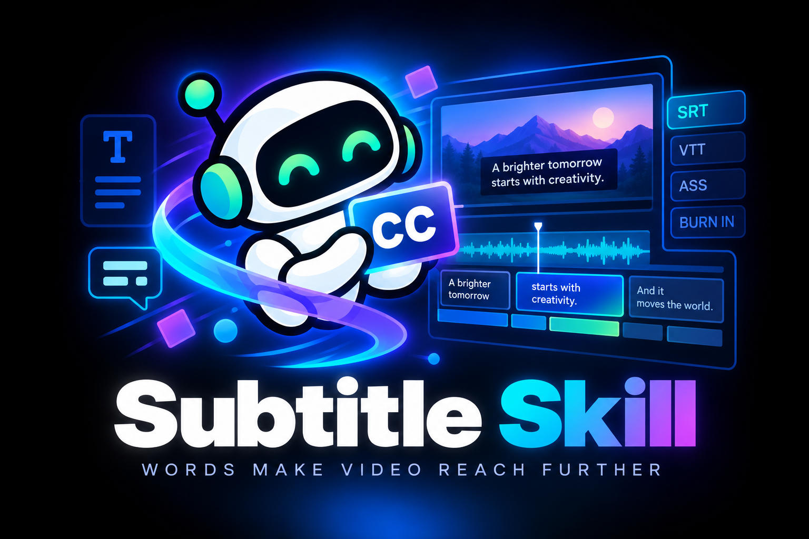
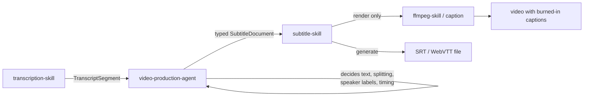
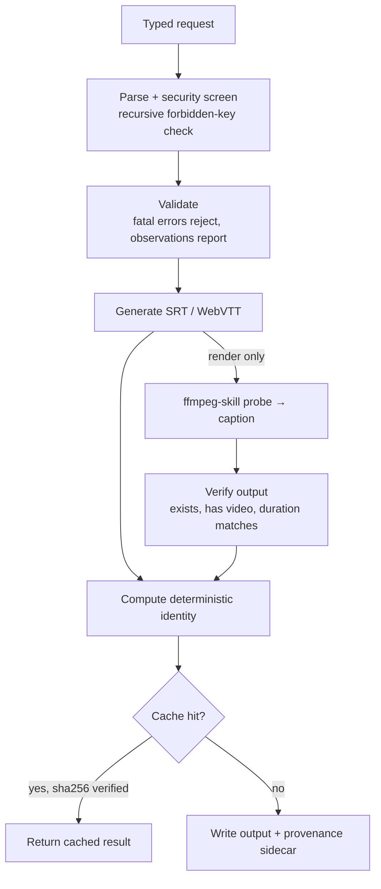

<p align="center">
  
</p>

<h1 align="center">subtitle-skill</h1>

<p align="center"><strong>Words make video reach further — deterministically.</strong></p>

<p align="center">
  Typed subtitle documents · Local execution · No AI reasoning · No cloud<br>
  Part of the same execution-skill ecosystem as <a href="https://github.com/kajisho5/ffmpeg-skill">ffmpeg-skill</a>
</p>

<p align="center">
  <a href="https://github.com/kajisho5/subtitle-skill/actions/workflows/ci.yml"></a>
  
  
  <a href="LICENSE"></a>
</p>

```bash
pip install -e .
```

`subtitle-skill` is not "AI that writes captions." It is the execution
layer that turns a subtitle *decision* — already made by an upstream
agent — into a real artifact: validated, deterministic, verified, and
traceable. It never decides what a caption should say; it decides
whether the timeline is valid, generates SRT/WebVTT, and — by
delegating to [ffmpeg-skill](https://github.com/kajisho5/ffmpeg-skill)'s
`caption` tool — burns it into a video, then checks that the result is
actually correct.

If a typed `SubtitleDocument` and (for burn-in) an ffmpeg-skill install
are on hand, it works: no network access, no API keys, nothing decided
that wasn't handed to it.

---

**Contents**
[Why](#why) · [Quick start](#quick-start) · [How it works](#how-it-works) · [Design principles](#design-principles) · [Operations](#operations) · [Format support](#format-support) · [Validation is not cosmetic](#validation-is-not-cosmetic) · [Built for agents](#built-for-agents) · [ffmpeg-skill integration](#ffmpeg-skill-integration) · [Verified](#verified) · [Install](#install) · [Development](#development) · [Docs](#docs) · [Support](#support)

---

## Why

An agent that "handles captions" tends to guess: it burns a subtitle
past the end of the video and calls it done, it forgets that a WebVTT
file can't be burned in by the tool underneath it, or it reports success
because a process exited `0` without checking what actually got
written. subtitle-skill exists to take the guessing out of the
*execution* half of captioning:

- **Typed input, not a dict.** A subtitle is a `SubtitleDocument` of
  `SubtitleCue`s — parsed and validated once, never touched as raw JSON
  again.
- **Fatal vs. observation, never confused.** A broken timeline is
  rejected before anything is written. A borderline one (overlapping
  cues, a line that's too long) is reported, never silently "fixed" —
  no cue is ever deleted, reordered, merged, or shifted.
- **Verification after execution.** A render is only "done" when the
  output file exists, has a video stream, and its duration matches the
  *actual*, measured input — not when a subprocess happens to exit `0`.
- **A contract the agent can read.** `contract --json` states exactly
  which operations, formats, parameters and error codes this version
  supports. `doctor --json` states what can *actually* run right now.
- **No decisions made here.** What the text says, how it's split, which
  speaker to show — that's `video-production-agent`'s job. subtitle-skill
  only ever receives the result, as a typed request.

## Quick start

```bash
pip install -e .
subtitle-skill doctor --json     # what can actually run on this machine
subtitle-skill contract --json   # operations, formats, parameters, errors
```

Generate an SRT file from a typed subtitle document — no video needed:

```bash
cat > request.json <<'EOF'
{
  "operation": "generate",
  "workspace": "/tmp/subtitles-demo",
  "format": "srt",
  "output_path": "captions.srt",
  "subtitle": {
    "id": "doc-1",
    "language": "en",
    "cues": [
      {"id": "c1", "start": 0.0, "end": 2.5, "text": "Hello and welcome"},
      {"id": "c2", "start": 2.5, "end": 5.0, "text": "to the show.", "speaker": "Host"}
    ]
  }
}
EOF
subtitle-skill run request.json --json
```

```json
{"status": "ok", "operation": "generate", "output": ".../captions.srt",
 "sha256": "4ffe0640...", "size": 103, "reused": false,
 "observation": [], "timeline": {"cue_count": 2}, ...}
```

Burning that same subtitle into a video — `"operation": "render"` —
needs `format: "srt"` and a reachable ffmpeg-skill install (see
[ffmpeg-skill integration](#ffmpeg-skill-integration)); the request
shape is identical otherwise, just add `video_input`.

## How it works



subtitle-skill sits at the bottom of that chain, as a *leaf* execution
skill: it receives an already-decided, typed request and executes it
mechanically. Internally:



## Design principles

These are the rules the code enforces — not aspirations.

1. **Typed, not stringly.** Every subtitle is a `SubtitleDocument` /
   `SubtitleCue` / `SubtitleStyle` — parsed through `from_dict` once;
   nothing downstream touches a raw dict.
2. **Fatal and observation are never the same code path.** `start < 0`,
   `end <= start`, NaN/Infinity, duplicate ids, empty/invalid text, and a
   cue past the video's real duration reject the request outright.
   Overlaps, long lines, short/long cues, and reading speed are reported
   in `observation` and never auto-corrected.
3. **The request's `video_duration` is a hint, not a fact.** For
   `render`, the document is re-validated against ffmpeg-skill's own
   measured duration of the actual video — an omitted or wrong hint
   can't let a cue past the real end of the video through silently.
4. **No shell, no arbitrary executable, no arbitrary filter.** Every
   subprocess call is a fixed argv list. `command`, `argv`, `shell`,
   `executable`, `filter`, `filter_complex`, `vf`, `af`, `env`, `api_key`
   are rejected anywhere in the request, at any nesting depth.
5. **Workspace-confined paths.** Absolute paths, drive-qualified paths,
   `..`, and Windows reserved device names are rejected; a resolved
   (symlink-following) path must still land inside the workspace root.
6. **Exit code `0` is never sufficient.** A render is accepted only when
   ffmpeg-skill reports `"status": "completed"`, the output file exists
   and is non-empty, it has a video stream, and its duration matches the
   input within 0.25s.
7. **Deterministic identity, content-addressed.** Same document, format,
   constraints (and for `render`, the same video and the same
   ffmpeg-skill script content) → same identity → a verified cache hit,
   not a re-render. A corrupted or hash-mismatched cache is never
   returned as reused.
8. **Machine-readable contract.** `contract --json` is generated from
   what's actually implemented — an operation or format that isn't
   executable doesn't appear as supported.

## Operations

Two operations exist. Both appear in `contract --json`; nothing else
does — `convert`, `offset`, `merge`, and ASS/SSA are not implemented and
cannot be called.

| Operation | Video I/O | Formats | What it does |
|---|---|---|---|
| `generate` | none | SRT, WebVTT | Validate the document, write a subtitle file |
| `render` | required | **SRT only** | Validate against the real video duration, generate the SRT, delegate burn-in to ffmpeg-skill's `caption` tool, verify the output |

```json
{
  "operation": "generate | render",
  "workspace": "/absolute/path/to/workspace",
  "format": "srt | vtt",
  "output_path": "relative/output.srt",
  "video_input": "relative/input.mp4",
  "video_duration": 123.4,
  "subtitle": {
    "id": "doc-1", "language": "ja",
    "cues": [{"id": "c1", "start": 0.0, "end": 2.0, "text": "...", "speaker": "A", "style": {"align": "center"}}]
  },
  "constraints": {"max_chars_per_line": 42, "max_lines": 2, "min_duration": 0.5, "max_duration": 10, "reading_speed_cps": 20}
}
```

`video_input` / `video_duration` apply to `render` only; `constraints`
is optional for both (see [Validation](#validation-is-not-cosmetic)).

## Format support

| | `generate` | `render` (burn-in) |
|---|---|---|
| SRT | ✅ | ✅ |
| WebVTT | ✅ | ❌ `UNSUPPORTED_FORMAT` |

**Generating a WebVTT file does not mean it can be burned in.** This is
a real constraint of the tool `render` delegates to — ffmpeg-skill's
`caption` burns SRT or ASS, never WebVTT — not an arbitrary restriction.
Requesting `render` with `format: "vtt"` fails immediately, before
anything is generated.

Neither generator silently drops style it can't represent — it raises
`UNSUPPORTED_FORMAT` instead:

| | SRT | WebVTT |
|---|---|---|
| `align` / `position` / `line` / `size` | rejected (no native positioning) | native cue settings |
| `bold` / `italic` | `<b>` / `<i>` tags | `<b>` / `<i>` tags |
| `color` | rejected | rejected (no safe, non-CSS-injecting form here) |
| `speaker` | `"Speaker: "` text prefix | `"Speaker: "` text prefix |

Cue/document `metadata` is auxiliary/provenance data — never written
into the rendered subtitle body of either format.

## Validation is not cosmetic

Fatal and observation are separate systems, not a severity slider:

**Fatal** — nothing is written:
`start < 0`, `end <= start`, NaN/Infinity timestamps, duplicate cue ids,
empty/whitespace-only or invalid-Unicode/control-character text, a cue
past the video's actual duration.

**Observation** — reported, never auto-corrected:
`CUE_OVERLAP`, `TOO_MANY_LINES`, `LINE_TOO_LONG`, `CUE_TOO_SHORT`,
`CUE_TOO_LONG`, `READING_SPEED_TOO_HIGH`.

Thresholds (`max_chars_per_line`, `max_lines`, `min_duration`,
`max_duration`, `reading_speed_cps`) are caller-supplied `constraints`,
not hard-coded domain assumptions — defaults exist only so a caller may
omit `constraints` entirely.

## Built for agents

subtitle-skill is a process boundary meant to be called by another
agent, not a general-purpose CLI tool.

```bash
subtitle-skill contract --json   # every operation, format, parameter, error this version supports
subtitle-skill doctor --json     # what can actually run right now
subtitle-skill run req.json --json   # execute one operation — always one JSON document on stdout
```

`contract --json` is generated to match what's implemented, not
maintained beside it by hand: `deterministic: true`, per-operation
`formats`, the full error-code list under `errors`, and `out_of_scope`
naming what this skill deliberately does not do. `doctor --json` reports
`render` as available only when an ffmpeg-skill install is found *and*
its own `doctor` confirms the `caption` tool's required capabilities
(`ffmpeg`, `ffprobe`, `encoder:libx264`, `encoder:aac`,
`filter:subtitles`) — subtitle-skill asks ffmpeg-skill's own detection
rather than re-implementing FFmpeg capability probing.

[`SKILL.md`](SKILL.md) is the agent-facing usage guide: when to call this
skill, how to build a `SubtitleDocument`, the fatal/observation
distinction, and failure handling — written so an agent doesn't have to
read the source to use this correctly.

No MCP server, plugin loader, or agent-framework integration exists in
this repository — only the CLI process boundary above.

### Deterministic identity and reuse

A content-addressed identity is computed from the skill version,
contract version, operation, the full canonical subtitle document,
format, and constraints — never from timestamps, PIDs, or temp paths.
For `render`, it additionally includes the input video's sha256 and a
sha256 of the ffmpeg-skill scripts that will actually execute
(`caption.py` + `_common.py`) — a content hash, not ffmpeg-skill's
self-reported `package.json` version string, because a version string is
only as trustworthy as whoever last edited it. If an output and its
`<output>.subtitle-skill.json` sidecar already match the current
identity, the sidecar's recorded sha256 is **re-verified against the
file on disk** before being reported as `"reused": true`; a corrupted or
hash-mismatched output is regenerated, never returned as reused.

### Provenance

Every artifact's sidecar and response record how it was produced:
`skill` / `skill_version` / `contract_version`, `operation`, `sha256`,
`size`, `reused`, `observation`, `timeline`, and for `render`: `engine`
(`"ffmpeg-skill"`), `engine_version` (display only — its `package.json`
version), `engine_script_sha256` (the real identity anchor, above), and
`engine_response` (ffmpeg-skill's own reported `commands` and `probe` —
always its actual values, never fabricated here).

### Security

- No shell (`shell=True` is never used); every subprocess call is a
  fixed argv list.
- No caller-supplied executable path, FFmpeg filter string, or raw
  command, at any layer.
- Every request, at any nesting depth, is screened before parsing:
  `command` / `argv` / `shell` / `executable` / `filter` /
  `filter_complex` / `vf` / `af` / `env` / `api_key` anywhere reject it.
- Workspace-confined, symlink-aware `PathPolicy`: absolute/drive paths,
  `..`, and Windows reserved names rejected; a resolved path must still
  land inside the workspace root.
- Typed, stable error codes everywhere — see `errors` in
  `contract --json`.

This is what subtitle-skill refuses to do, not a claim that it's
unbreakable.

## ffmpeg-skill integration

`render` delegates burn-in to
[ffmpeg-skill](https://github.com/kajisho5/ffmpeg-skill)'s `caption`
tool. **There is no single dispatch endpoint in ffmpeg-skill** — every
tool is its own script:

```
python3 <ffmpeg-skill-install-dir>/scripts/<tool>.py [args] --json
```

`subtitle_skill.engine`:

1. locates the ffmpeg-skill install directory via
   `SUBTITLE_SKILL_FFMPEG_SKILL_DIR`, or the directories ffmpeg-skill's
   own installer writes to (`~/.claude/skills/ffmpeg-skill`,
   `~/.cursor/skills/ffmpeg-skill`, `~/.codex/skills/ffmpeg-skill`,
   `./.claude/skills/ffmpeg-skill`);
2. runs `scripts/probe.py <video> --json` first, to confirm a video
   stream exists and measure the *actual* duration for validation;
3. runs `scripts/caption.py <video> --srt <srt> -o <output> --json` — a
   fixed argv list, never a shell;
4. accepts the result only when exit code `0`, `"status": "completed"`,
   a non-empty output file, a `probe.video` in the response, and an
   output duration within 0.25s of the input's — all hold.

Failure responses follow ffmpeg-skill's own shape —
`{"status": "failed", "error": {"kind": "input"|"ffmpeg"|"missing_tool", "message": "..."}}`
— mapped to `INVALID_INPUT` / `TOOL_ERROR` / `DEPENDENCY_ERROR`
respectively; anything ffmpeg-skill didn't produce at all (crash,
timeout, malformed stdout) is `DEPENDENCY_ERROR`.

ffmpeg-skill's own contract marks `caption` as needing visual
verification (`ffmpeg-skill/look`, a PNG contact sheet, for a human or
agent to inspect). subtitle-skill deliberately does not run or interpret
`look` — judging whether burnt-in captions *look* right is exactly the
visual/AI judgement this skill's mandate excludes. That verification, if
wanted, belongs to whoever is driving the render.

## Verified

| Result | Measurement |
|---|---|
| **89 / 89** | full test suite — models, validation, formats, security, `PathPolicy`, CLI/contract, doctor, engine boundaries, and render delegation |
| **against real ffmpeg-skill** | render tests run a vendored, byte-identical copy of ffmpeg-skill's actual `caption.py` / `probe.py` / `_common.py` (kajisho5/ffmpeg-skill, skill version 0.9.1) — not a hand-rolled stub — including a real burn-in verified by `ffprobe` and by asserting ffmpeg-skill's own reported command line used the `subtitles=` filter |
| **6 CI jobs green** | Ubuntu, macOS, Windows × Python 3.9, 3.11 |
| **cache correctness proven both directions** | a bare ffmpeg-skill version bump with unchanged scripts does *not* invalidate the cache; a script content change with an unbumped version *does* |

```bash
pytest -q
```

Only the Linux CI job is guaranteed to have `ffmpeg` on `PATH`; the
real-burn-in tests `skip` gracefully elsewhere, so "CI green" means
"logic verified everywhere," not "burn-in verified identically on every
OS."

## Install

```bash
pip install -e .          # from a checkout; not yet published to PyPI
```

## Requirements

- Python 3.9+ (declared in `pyproject.toml`; the floor version is
  actually exercised in CI, not just declared)
- For `render` only: an [ffmpeg-skill](https://github.com/kajisho5/ffmpeg-skill)
  install reachable via `SUBTITLE_SKILL_FFMPEG_SKILL_DIR` or its
  standard install locations, itself requiring FFmpeg with `libx264`,
  `aac`, and the `subtitles` (libass) filter — `doctor --json` reports
  exactly what's missing.

## Development

```bash
pip install -e .
pip install pytest
pytest -q
```

CI (`.github/workflows/ci.yml`) runs on Ubuntu, macOS, and Windows, on
Python 3.9 and 3.11 (6 jobs). `PathPolicy` behavior is consistent across
all three OSes.

## Docs

| | |
|---|---|
| [SKILL.md](SKILL.md) | what an agent reads: when to call this skill, building a `SubtitleDocument`, fatal vs. observation, failure handling |
| `contract --json` | the authoritative, machine-readable operation/format/error list — if this README and the live contract ever disagree, the contract is correct |
| [tests/fixtures/ffmpeg_skill_vendor/README.md](tests/fixtures/ffmpeg_skill_vendor/README.md) | provenance of the vendored ffmpeg-skill scripts used in the render tests |
| [CLAUDE.md](CLAUDE.md) | repository status for maintainers: ecosystem integration state, known gaps, next tasks |

There is no separate `docs/` directory at this time.

## Limitations / Out of scope

Not implemented, and not this skill's mandate — these belong to
`video-production-agent` (decision-making) or a dedicated skill:
automatic transcription, speaker diarization, translation, summarization,
AI-generated or AI-edited subtitle text, automatic cue splitting,
automatic subtitle "design" decisions, scene/semantic understanding,
cloud upload, MCP or plugin-loader integration, arbitrary FFmpeg command
or filter execution.

Not yet implemented, and not advertised in `contract --json`: `convert`,
`offset`, `merge`, ASS/SSA generation or rendering.

## Support

If this skill saves you time, you can help keep it maintained through
[GitHub Sponsors](https://github.com/sponsors/kajisho5). Issues and pull
requests are just as welcome.

## License

[MIT](LICENSE)
